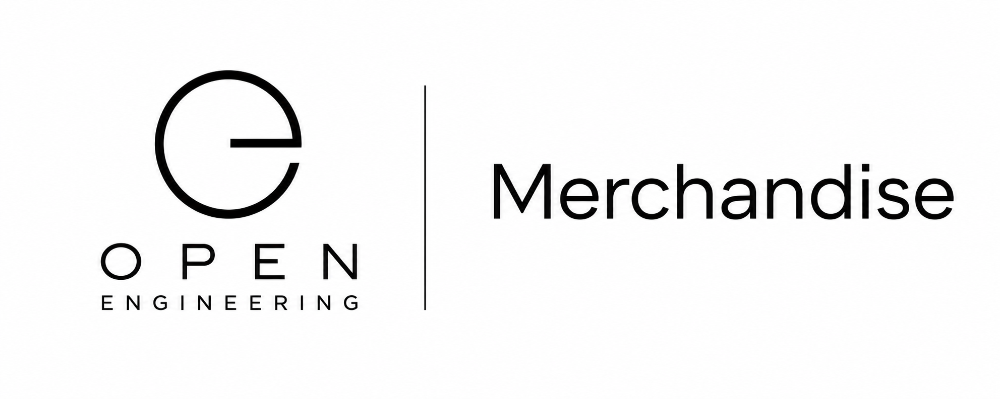

# Open Engineering Merchandise

<p align="center">
  
</p>
<p align="center">
  <strong>Engineering ideas you can hold.</strong>
</p>
<p align="center">
  Physical artifacts, merchandise, promotional materials, and tangible expressions of the Open Engineering ecosystem.
</p>

⸻

#€ About

Open Engineering Merchandise is the home of physical artifacts created for and around the Open Engineering ecosystem.

Open Engineering normally exists as code, knowledge, conventions, diagrams, stories, systems, and running infrastructure.

Sometimes, however, engineering should leave the screen.

A coaster on a table.

A sticker on a laptop.

A card used during a workshop.

A poster explaining an architecture.

A shirt worn at an event.

A physical artifact can make an engineering idea visible, memorable, shareable, and discoverable.

Open Engineering Merchandise provides a place to define, design, version, manufacture, and distribute those artifacts.

From repositories to reality.

⸻

## Why Merchandise?

Merchandise is more than branding.

Within Open Engineering, physical artifacts can become another interface into the engineering ecosystem.

A QR code on a coaster can lead to documentation.

A card can represent an engineering element.

A sticker can identify a project or capability.

A poster can visualize an architecture.

A physical game component can participate in an Open Engineering Game.

A conference handout can point directly to executable examples.

The physical and digital worlds can therefore remain connected.
```
Physical Artifact
       │
       ▼
   QR / URI
       │
       ▼
open-engineering.io
       │
       ▼
Open Engineering
       │
       ├── Documentation
       ├── Repositories
       ├── Stories
       ├── Training
       ├── Games
       ├── Elements
       └── Experiences
```
⸻

## Merchandise Categories

Open Engineering Merchandise may include many kinds of physical artifacts.

### Coasters

Beer mats and coasters for events, meetups, workshops, demonstrations, and informal conversations.

For example:

FRONT
Open Engineering
visual identity
       ↓
BACK
Open Engineering
QR code

The QR code can use campaign-specific URLs so engagement originating from physical artifacts can be measured.

⸻

## Stickers

Stickers can represent:

* Open Engineering
* projects
* organizations
* elements
* capabilities
* operating systems
* capsules
* runtimes
* conventions
* events

They can also provide QR-based entry points into the ecosystem.

⸻

## Cards

Physical cards can support:

* Open Engineering Games
* architecture workshops
* planning sessions
* training
* storytelling
* system modelling
* capability discovery
* engineering exercises

Cards may correspond directly to machine-readable Open Engineering entities.
```
Physical Card
     │
     ▼
Open Engineering Identifier
     │
     ▼
Semantic Entity
```
⸻

## Apparel

Potential apparel includes:

* T-shirts
* hoodies
* caps
* jackets
* conference clothing

Designs should follow the Open Engineering visual identity and remain reproducible from version-controlled source assets.

⸻

## Posters

Posters can visualize:

* architectures
* engineering maps
* periodic tables
* workflows
* systems
* stories
* learning paths
* reference material

Where practical, posters should link back to their digital source through a QR code.

⸻

## Event Materials

Open Engineering Merchandise can also contain materials intended specifically for events.

Examples include:

* badges
* table cards
* banners
* signs
* handouts
* workshop materials
* demonstration props
* conference giveaways

⸻

## Books and Notebooks

Future physical publications could include:

* engineering notebooks
* field guides
* reference cards
* training workbooks
* Open Engineering manuals
* workshop books

Their source material should preferably remain openly available and version controlled.

⸻

## Physical ↔ Digital

A central principle of Open Engineering Merchandise is that physical artifacts should be able to connect back to their digital origins.

For example:
```
┌──────────────────────────┐
│                          │
│     OPEN ENGINEERING     │
│                          │
│          ▣               │
│        QR CODE           │
│                          │
└────────────┬─────────────┘
             │
             ▼
     open-engineering.io
             │
             ▼
      Digital Artifact
             │
     ┌───────┼────────┐
     ▼       ▼        ▼
   Docs    Source   Experience
```
QR destinations may include campaign metadata so physical interactions can be measured without changing the underlying artifact concept.

For example:

https://open-engineering.io/?utm_source=beermat&utm_medium=qr&utm_campaign=open_engineering

⸻

## Merchandise as Engineering Artifacts

Open Engineering treats merchandise itself as something that can be engineered.

A merchandise item can have:
```
Concept
   ↓
Design
   ↓
Specification
   ↓
Source Assets
   ↓
Production Assets
   ↓
Manufacturer
   ↓
Production Run
   ↓
Physical Artifact
   ↓
Digital Interaction
```
This makes physical production reproducible rather than ad hoc.

⸻

## Repository Model

The organization can separate merchandise definitions from individual merchandise implementations.
```
open-engineering-merchandise
│
├── .github
│   └── profile
│
└── source
        │
        ├── catalog
        ├── designs
        ├── specifications
        ├── templates
        └── production
```
Individual artifacts may eventually be maintained as separately versioned implementations where that provides value.

⸻

## Suggested Artifact Structure

A merchandise artifact could follow a structure such as:
```
coaster/
├── README.md
├── merchandise.yaml
├── design/
│   ├── front.svg
│   └── back.svg
├── production/
│   ├── front.pdf
│   └── back.pdf
├── previews/
│   ├── front.png
│   └── back.png
└── qr/
    ├── destination.txt
    └── qr.svg
```
The SVG files remain the editable design source.

PDF files can contain printer-ready output.

PNG files provide convenient previews.

⸻

## Machine-Readable Merchandise

Where useful, merchandise can have machine-readable metadata.

For example:
```
apiVersion: open-engineering.io/v1alpha1
kind: Merchandise
metadata:
  name: open-engineering-coaster
spec:
  category: coaster
  shape: round
  design:
    front: design/front.svg
    back: design/back.svg
  qr:
    destination: >-
      https://open-engineering.io/?utm_source=beermat&utm_medium=qr&utm_campaign=open_engineering
  production:
    printable: true
```
This allows merchandise to participate in the wider Open Engineering model.

⸻

## Design Principles

### Open

Source artwork and specifications should be openly available whenever possible.

### Reproducible

A physical artifact should be reproducible from its repository.

### Versioned

Designs and production specifications evolve through version control.

### Traceable

The relationship between source design, production file, and manufactured artifact should remain understandable.

### Machine Readable

Metadata should make merchandise understandable by both humans and software.

### AI Native

AI agents should be able to discover, understand, modify, validate, and prepare merchandise designs for production.

### Brand Consistent

Artifacts should follow the Open Engineering visual identity and relevant conventions.

### Physical + Digital

Where useful, physical artifacts should provide a bridge back into the digital Open Engineering ecosystem.

⸻

## Example — Open Engineering Coaster

One of the first Open Engineering merchandise experiments is a round coaster.
```
                  FRONT
             ╭────────────╮
          ╭──               ──╮
        ╭                       ╮
       │                         │
       │     OPEN ENGINEERING    │
       │                         │
        ╰                       ╯
          ╰──               ──╯
             ╰────────────╯
                   BACK
             ╭────────────╮
          ╭──               ──╮
        ╭                       ╮
       │     Open Engineering    │
       │                         │
       │          ▣▣▣            │
       │          ▣▣▣            │
        ╰                       ╯
          ╰──               ──╯
             ╰────────────╯
```
The circular Open Engineering identity can align naturally with the edge of the coaster.

The reverse provides the project name and a QR-based bridge into the online ecosystem.

⸻

## Relationship to Open Engineering

Merchandise sits at the physical boundary of Open Engineering.
```
                    Open Engineering
                           │
          ┌────────────────┼────────────────┐
          │                │                │
          ▼                ▼                ▼
       Digital          Semantic         Physical
          │                │                │
          ▼                ▼                ▼
        Code           Knowledge       Merchandise
        Docs            Elements          Cards
       Runtimes        Ontologies        Coasters
        Games             Maps           Posters
       Stories         Relations         Apparel
          │                │                │
          └────────────────┼────────────────┘
                           │
                           ▼
                       Experience
```
The objective is not simply to place a logo on products.

The objective is to make the physical artifact another entry point into Open Engineering.

⸻

## Open Engineering

Open Engineering explores an open, composable, AI-native approach to engineering in which knowledge, systems, tools, processes, and experiences can be described as reusable and interoperable building blocks.

Learn more at:

open-engineering.io

⸻

<p align="center">
  <strong>Open Engineering Merchandise</strong><br>
  From repositories to reality.
</p>
